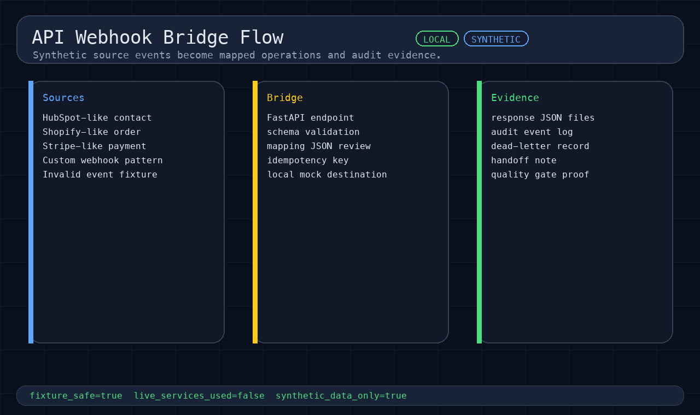
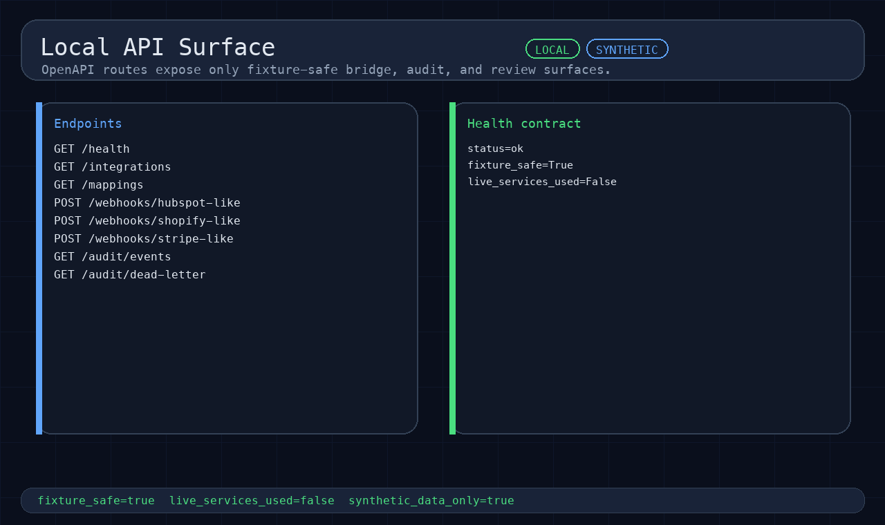
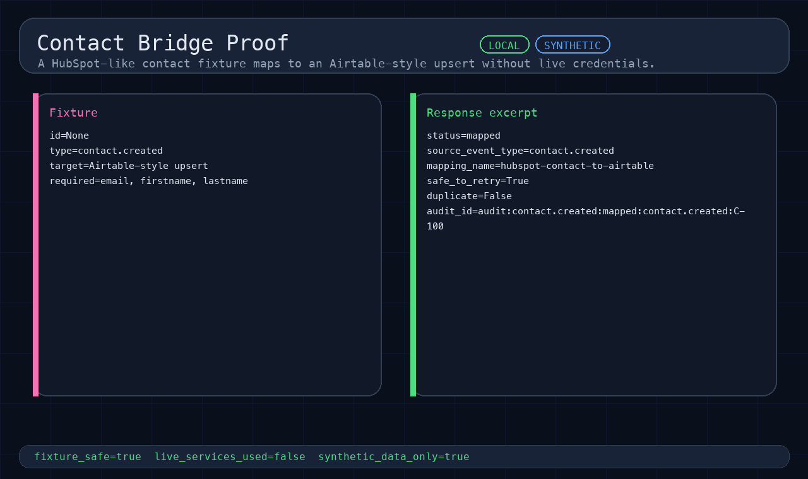
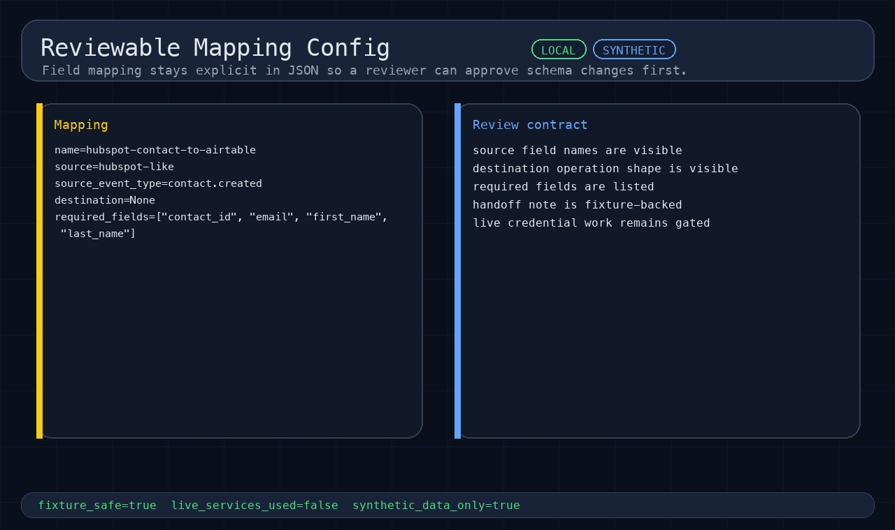
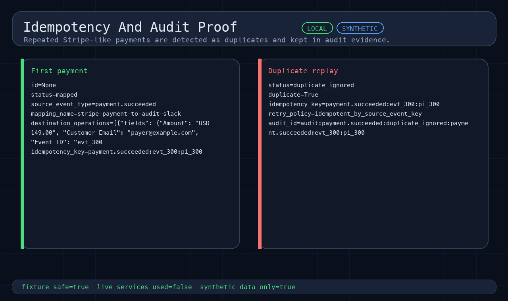
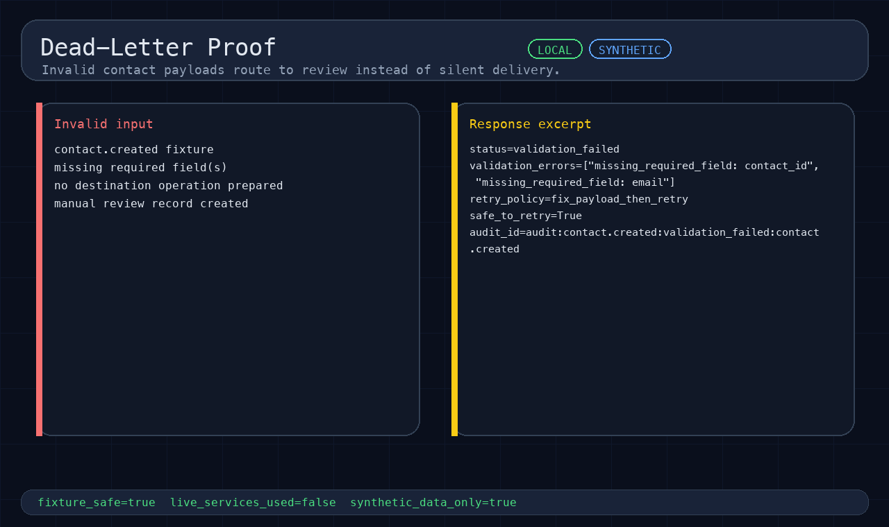
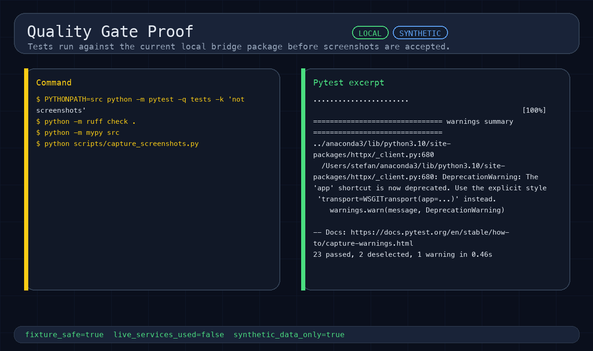
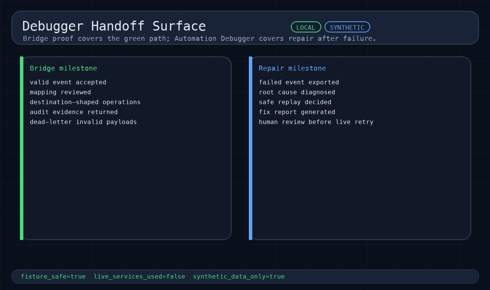

# API Webhook Bridge

Fixture-safe FastAPI webhook bridge template for validating payloads, mapping fields, handling
duplicates, and auditing integration flows before connecting live external-service
credentials.

It proves a safe first milestone for integration jobs: receive one source event, validate it,
map fields into destination-shaped operations, return request/response evidence, write
audit/dead-letter proof, and leave handoff notes before any live account is touched.

## What it connects locally

This repo uses short, synthetic fixtures instead of live external-service exports. Each flow
writes matching response evidence under `examples/api-responses/`, with visual proof in the
evidence package below.

| Flow | Input | Destination | Result |
|---|---|---|---|
| Contact | `contact-created` | Airtable-style upsert | Validate and map locally. |
| Order | `shopify-order-created` | Slack alert + CRM note | Prepare two mock ops. |
| Payment | `stripe-payment-succeeded` | Audit record + Slack alert | Prove idempotency. |
| Invalid contact | `contact-created-invalid` | Dead-letter review | Block bad payload. |

All systems are synthetic and local. The project does not call HubSpot, Shopify, Stripe,
Airtable, Slack, CRM, or a cloud service.

## Evidence package

Below is the local proof-of-concept evidence for the bridge: source events, mapping review,
idempotency, dead-letter handling, quality gates, and the debugger handoff path.

[](docs/screenshots/01-flow-overview.png)

[](docs/screenshots/02-openapi-webhook-endpoints.png)

[](docs/screenshots/03-contact-bridge-proof.png)

[](docs/screenshots/04-mapping-config.png)

[](docs/screenshots/05-idempotency-audit.png)

[](docs/screenshots/06-dead-letter.png)

[](docs/screenshots/07-quality-gates.png)

[](docs/screenshots/08-debugger-handoff.png)

Supporting written evidence:

- Walkthrough narrative: `docs/sandbox-walkthrough.md`
- Command evidence and local gates: `docs/evidence.md`
- Case study: `docs/case-study.md`
- Screenshot guide: `docs/screenshots/README.md`

The screenshots are generated proof panels from synthetic local fixtures. They show no live
account screens, credentials, browser tabs, private desktop context, or customer data.

## Run the sandbox walkthrough

Use a sibling Automation Kit checkout, then regenerate the API responses locally:

```bash
python -m venv .venv
source .venv/bin/activate
pip install -e ../automation-kit
pip install -e '.[dev]'
export AUTOMATION_KIT_PATH=../automation-kit
PYTHONPATH="$AUTOMATION_KIT_PATH/src:src" examples/run-sandbox-walkthrough.sh
```

Inspect locally:

- `GET /health`
- `GET /integrations`
- `GET /mappings`
- `POST /webhooks/hubspot-like`
- `POST /webhooks/shopify-like`
- `POST /webhooks/stripe-like`
- `GET /audit/events`
- `GET /audit/dead-letter`

## Adapt this template

| Source | Target | Use case | Change |
|---|---|---|---|
| Stripe payment | Airtable + Slack | Ops alert | payment fixture + mapping |
| Shopify order | CRM + Slack | Order note | order fixture + mapping |
| HubSpot contact | Airtable/Sheets | Lead sync | contact fixture + mapping |
| Typeform lead | CRM/Slack | Lead routing | lead fixture + schema |
| Custom webhook | Database/API | Internal bridge | fixture schema + adapter |

These are adaptation paths, not live-provider claims. Live credentials, OAuth scopes, provider
dashboards, and real webhook delivery logs are separate gated work.

## Built on Automation Kit

Automation Kit is the reusable backbone. This repo is the thin buyer-shaped spoke.

Used backbone modules:

- `auto_kit.pattern_runner` for pattern/workflow vocabulary;
- `auto_kit.mock_clients` for deterministic CRM and Slack-style mock destination preparation;
- `auto_kit.workflow_schema` for validated workflow contract language.

See `docs/automation-kit-backbone.md` and `docs/automation-kit-case-study-contract.md`.

## Project docs

| Proof surface | Path |
|---|---|
| Sandbox walkthrough | `docs/sandbox-walkthrough.md` |
| Case study | `docs/case-study.md` |
| Command evidence and local gates | `docs/evidence.md` |
| FastAPI/OpenAPI notes | `docs/api.md` |
| Mapping configs | `configs/mappings/` |
| API request examples | `examples/api-requests/` |
| API response examples | `examples/api-responses/` |
| Screenshots | `docs/screenshots/` |
| First milestone copy | `docs/first-milestone.md` |
| Production path notes | `docs/production-path.md` |
| Public readiness checklist | `docs/public-readiness-checklist.md` |

## Safety boundary

- Fixture-safe synthetic examples only.
- Empty credential placeholders only.
- `fixture_safe: true` and `live_services_used: false` are returned in proof responses.
- Runtime audit files under `.local/` are ignored.
- No live external-service calls, client data, cloud resources, public visibility changes,
  releases, or external sharing actions are part of the local proof.
- Public export, existing-repo visibility changes, private collaborator access,
  live external-service proof, and cloud deployment remain human-gated.

## First milestone shape

Map one approved source event to the destination schema, run it against synthetic or approved
sample data, return the validated output payload, audit log, retry/idempotency notes, and a
handoff note. Live credential connection happens only after that proof slice is reviewed.
