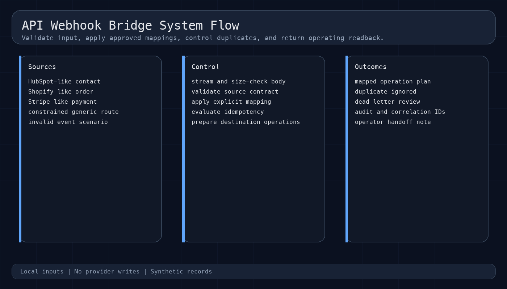
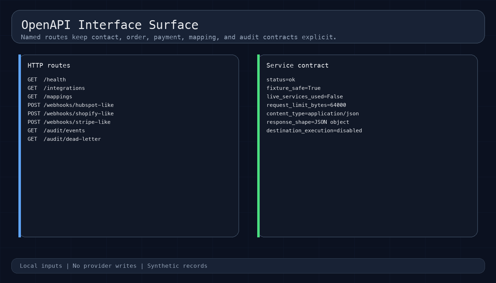
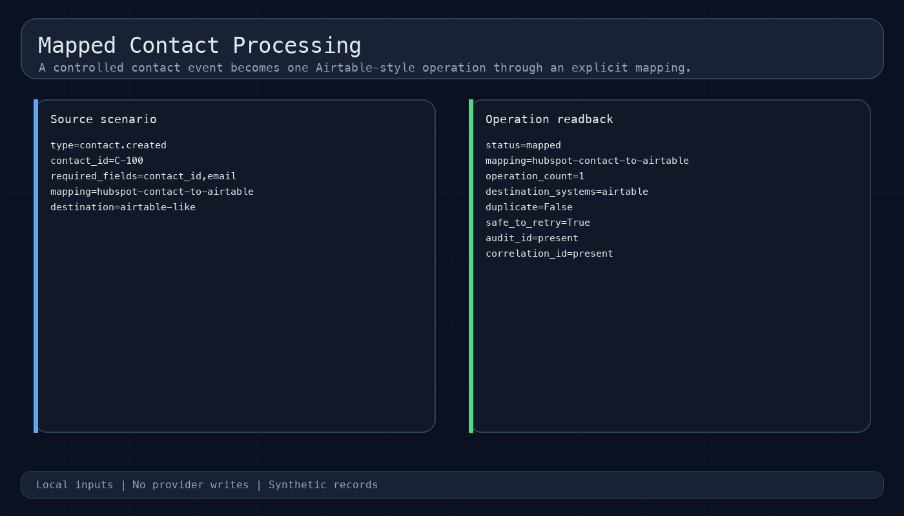
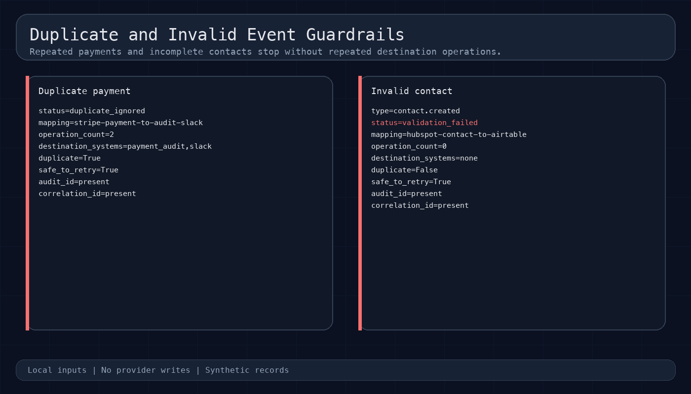
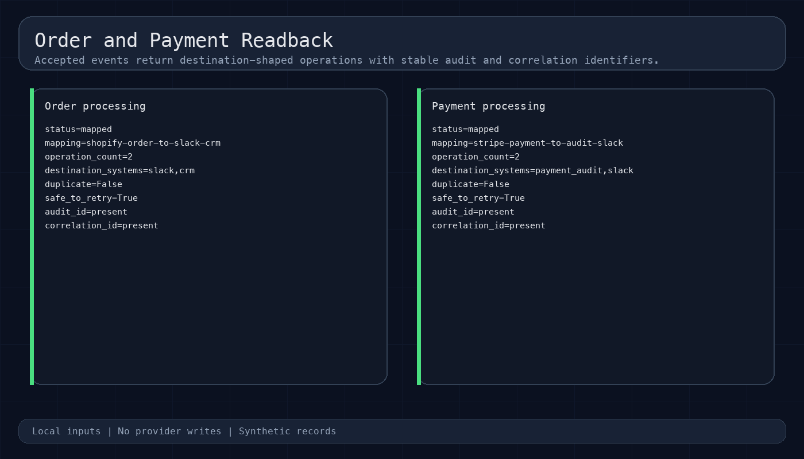
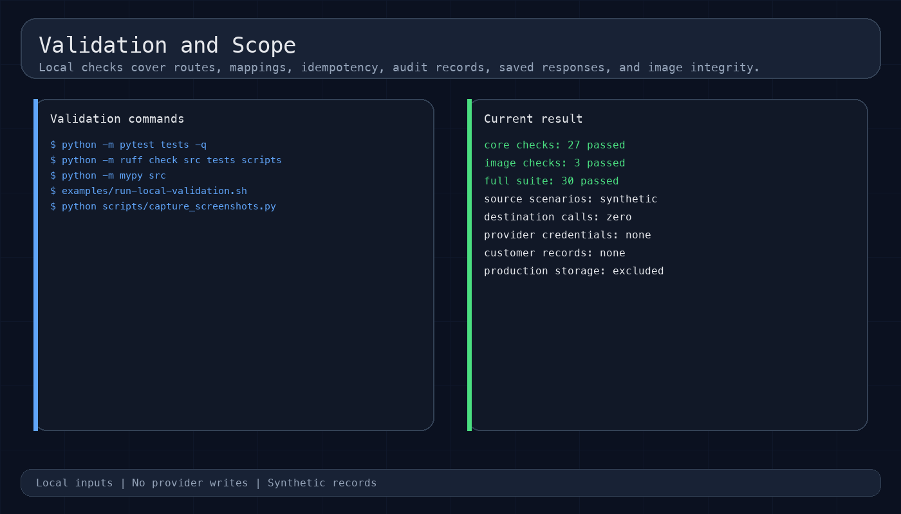

# API Webhook Bridge

Validate webhook events, map approved fields into destination-shaped operations, control duplicate delivery, and retain an auditable operating record.

[Case study](docs/case-study.md) | [API reference](docs/api.md) | [Dependency contract](docs/automation-kit-backbone.md)

## Overview

**Role:** integration design, FastAPI implementation, field mapping, duplicate controls and test coverage. **Status:** an SM Systems reference implementation tested with local provider-shaped contracts.

API Webhook Bridge is a FastAPI integration service for contact, order, and payment events. It checks the request boundary, validates the event contract, applies an explicit JSON mapping, evaluates idempotency, and returns either planned operations or a structured review outcome.

The included scenarios model HubSpot-like contacts, Shopify-like orders, Stripe-like payments, Airtable-style upserts, CRM notes, Slack-style alerts, and payment-audit records. All provider names describe local contract shapes; the repository makes no live provider calls.

## Capabilities

- Streams and limits webhook request bodies before JSON parsing.
- Validates three approved event families through explicit source contracts.
- Keeps source-to-destination field mappings in reviewable JSON.
- Prepares one or more deterministic destination-shaped operations.
- Detects duplicate deliveries through stable idempotency keys.
- Records accepted, duplicate, and rejected outcomes in local audit stores.
- Routes invalid or unsupported events to dead-letter review.
- Exposes named and constrained generic webhook routes through OpenAPI.

## Operating flow

```text
Webhook request
      |
      v
Size and JSON checks
      |
      v
Source contract validation
      |
      v
Field mapping and idempotency
      |
      +---------- duplicate ----------> audit record
      |
      +---------- invalid ------------> dead-letter review
      |
      v
Destination-shaped operations
      |
      v
Operating readback
```

No destination operation is executed by the local bridge. The response makes the mapping, operation count, idempotency key, correlation ID, and next action visible to an implementation team.

## Interfaces

| Method | Path | Purpose |
| --- | --- | --- |
| `GET` | `/health` | Return local service status. |
| `GET` | `/integrations` | List source, destination, and backbone scope. |
| `GET` | `/mappings` | Return the three visible mapping contracts. |
| `POST` | `/webhooks/hubspot-like` | Process a contact event. |
| `POST` | `/webhooks/shopify-like` | Process an order event. |
| `POST` | `/webhooks/stripe-like` | Process a payment event. |
| `POST` | `/webhooks/{source}` | Process the same constrained source set. |
| `GET` | `/audit/events` | Read accepted and duplicate outcomes. |
| `GET` | `/audit/dead-letter` | Read rejected-event records. |

Webhook bodies must be JSON objects and cannot exceed 64KB. Unknown sources return `404`; invalid JSON, oversized input, missing fields, duplicate events, and unsupported event types follow explicit response paths.

## System views

### System flow

[](docs/screenshots/01-system-flow.png)

### Interface surface

[](docs/screenshots/02-interface-surface.png)

### Core processing

[](docs/screenshots/03-core-processing.png)

### Guardrail and failure path

[](docs/screenshots/04-event-guardrails.png)

### Output and readback

[](docs/screenshots/05-operating-readback.png)

### Validation and scope

[](docs/screenshots/06-validation-scope.png)

The images are generated from committed local scenarios. They contain no provider account screens, customer records, credentials, browser chrome, private identifiers, or absolute desktop paths.

## Run locally

Python 3.11 is the reference runtime. Automation Kit is pinned to commit `b4b1df2730bc928b8c9ee96f716b706b41856cf1` in package metadata and CI.

```bash
git clone https://github.com/stefan-mcf/automation-kit.git ../automation-kit
git -C ../automation-kit checkout b4b1df2730bc928b8c9ee96f716b706b41856cf1

uv venv --python 3.11 .venv
source .venv/bin/activate
uv pip install -e ".[dev]"

export AUTOMATION_KIT_PATTERNS="$PWD/../automation-kit/patterns"
```

Start the local API:

```bash
uvicorn api_webhook_bridge.api:app --host 127.0.0.1 --port 8011
curl -fsS http://127.0.0.1:8011/health
```

OpenAPI JSON is available at `http://127.0.0.1:8011/openapi.json`; local interactive docs are available at `http://127.0.0.1:8011/docs`.

## Validation

```bash
python -m pytest tests -q
python -m ruff check src tests scripts
python -m mypy src
examples/run-local-validation.sh
python scripts/capture_screenshots.py
```

## Scope boundaries

- Synthetic fixtures and local storage only.
- No provider credentials, OAuth scopes, or customer records.
- No live HubSpot, Shopify, Stripe, Airtable, Slack, CRM, or cloud calls.
- Destination operations are prepared but not executed.
- In-memory idempotency and local JSONL audit storage are not production infrastructure.
- Production use requires durable storage, scoped adapters, retries, monitoring, deployment, and operator approval.

Every saved response declares:

```text
fixture_safe=true
live_services_used=false
```

## Project documentation

| Document | Purpose |
| --- | --- |
| [Case study](docs/case-study.md) | Engineering decisions, representative flows, and production extension. |
| [API reference](docs/api.md) | Routes, limits, and request contracts. |
| [Local operation](docs/local-operation.md) | Repeatable service and response-validation commands. |
| [Validation record](docs/validation.md) | Checked behaviour, saved responses, and boundaries. |
| [Dependency contract](docs/automation-kit-backbone.md) | Exact Automation Kit revision and imported modules. |
| [Production extension](docs/production-path.md) | Work required for live provider operation. |
| [Image index](docs/screenshots/README.md) | Functional image sequence and generation command. |

## License

MIT. See [LICENSE](LICENSE).
