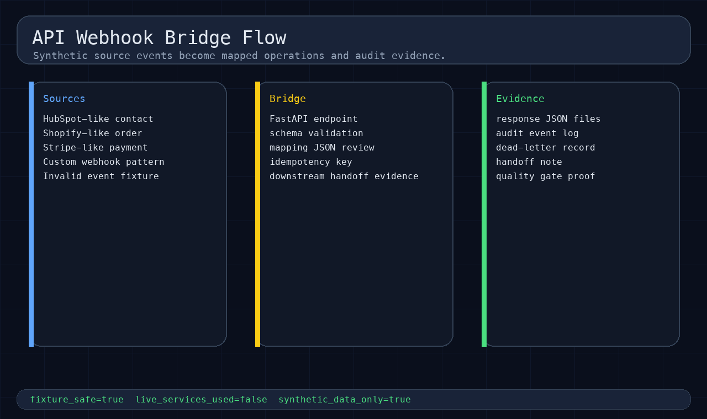
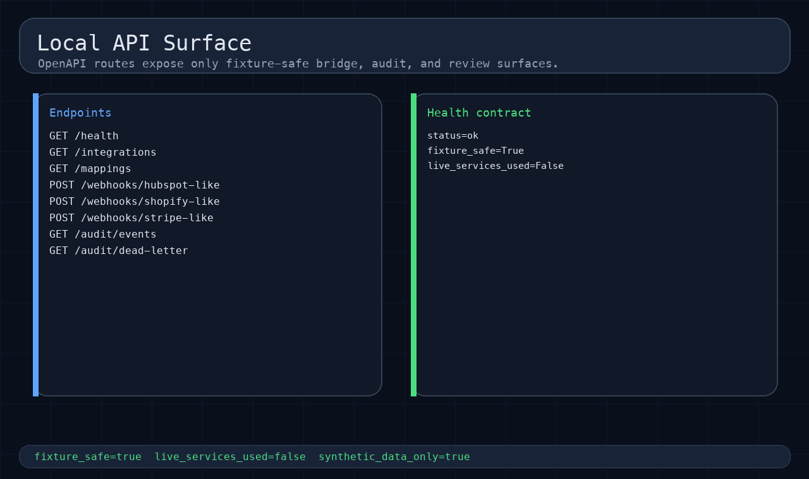
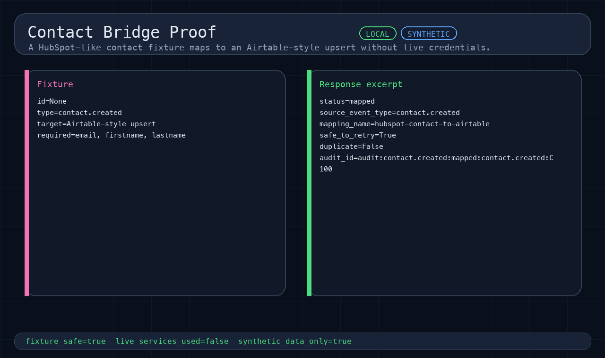
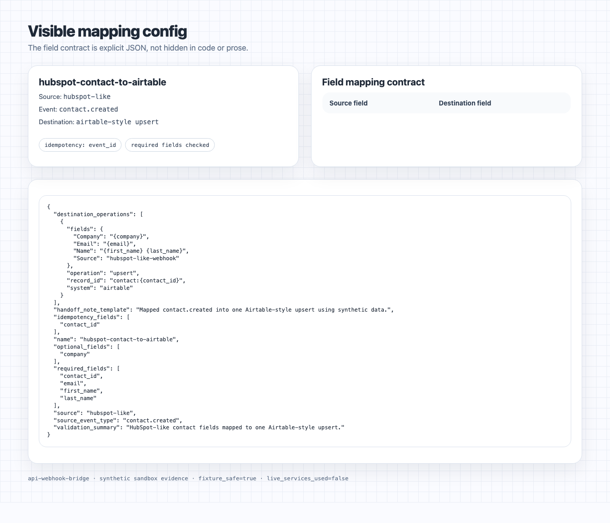
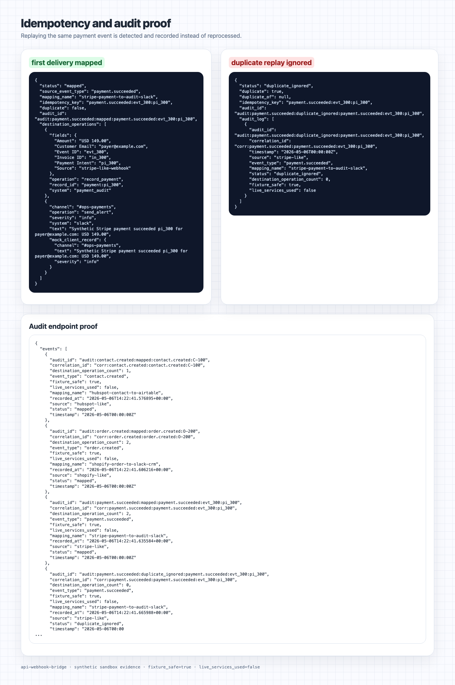
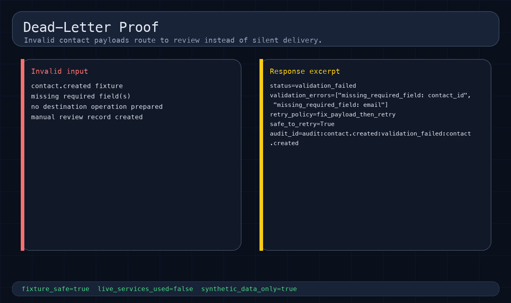
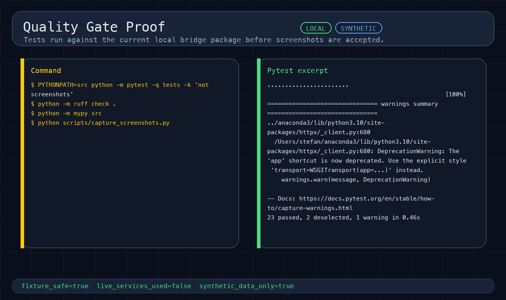
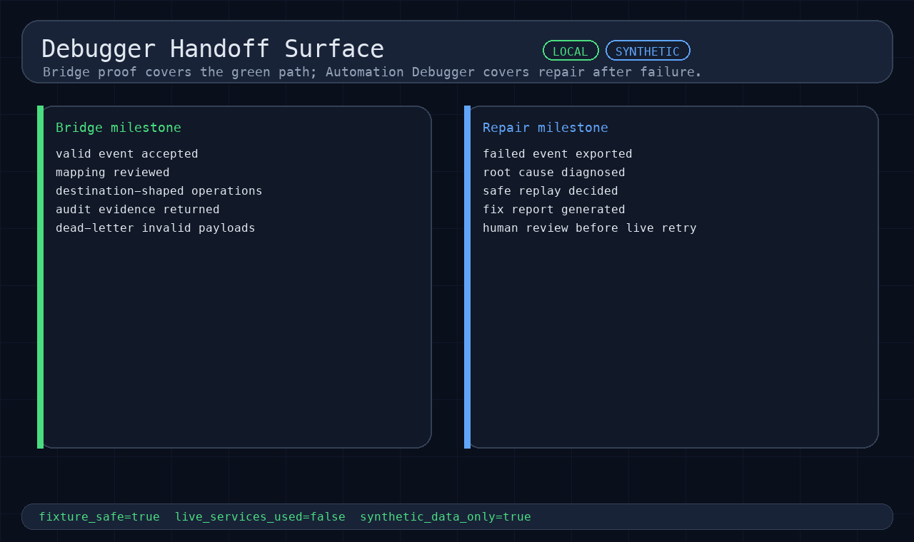
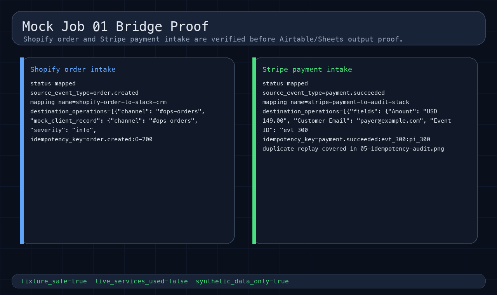

# API Webhook Bridge

Fixture-safe FastAPI webhook bridge for receiving webhook-style events locally, validating payloads, mapping fields into destination-shaped operations, handling duplicates, and recording audit/dead-letter output before any live credentials are introduced.

## What this repository does

- Accepts local webhook-style JSON payloads for contact, order, and payment flows.
- Validates request shape before any mapping logic runs.
- Maps approved source events into deterministic destination-shaped operations.
- Records successful processing and duplicate handling in local audit output.
- Captures invalid payloads in a local dead-letter log for review.
- Exposes a small OpenAPI surface for repeatable local verification and screenshots.
- Stays fixture-safe: no live provider calls, no cloud deployment, and no customer data.

## Included local flows

This repo uses short synthetic fixtures instead of live external-service exports. Each flow writes matching response evidence under `examples/api-responses/`.

| Flow | Input | Destination shape | Result |
|---|---|---|---|
| Contact | `contact-created` | Airtable-style upsert | Validate and map locally. |
| Order | `shopify-order-created` | Slack alert + CRM note | Prepare two mock ops. |
| Payment | `stripe-payment-succeeded` | Audit record + Slack alert | Prove idempotency. |
| Invalid contact | `contact-created-invalid` | Dead-letter review | Block bad payload. |

All systems are synthetic and local. The project does not call HubSpot, Shopify, Stripe, Airtable, Slack, CRM, or a cloud service.

## Quick start

### Minimal local setup

```bash
uv venv --python 3.11 .venv
source .venv/bin/activate
uv pip install -e ../automation-kit
uv pip install -e '.[dev]'
export AUTOMATION_KIT_PATH=../automation-kit
export PYTHONPATH="$AUTOMATION_KIT_PATH/src:src"
```

### Run the API locally

```bash
uvicorn api_webhook_bridge.api:app --host 127.0.0.1 --port 8011
```

In another terminal:

```bash
curl http://127.0.0.1:8011/health
```

OpenAPI JSON is available at `http://127.0.0.1:8011/openapi.json` and docs at `http://127.0.0.1:8011/docs`.

### Run the full walkthrough

```bash
source .venv/bin/activate
export AUTOMATION_KIT_PATH=../automation-kit
export PYTHONPATH="$AUTOMATION_KIT_PATH/src:src"
examples/run-sandbox-walkthrough.sh
```

If `python3` on macOS resolves to Python 3.10, the sibling `automation-kit` editable install will fail because it requires Python 3.11+. Use `uv venv --python 3.11 .venv` for a reproducible setup.

## Local API surface

| Method | Path | Purpose |
|---|---|---|
| GET | `/health` | Fixture-safe health check. |
| GET | `/integrations` | Lists supported source/destination scope and local integration contract. |
| GET | `/mappings` | Lists visible mapping configs. |
| POST | `/webhooks/hubspot-like` | Named contact intake route. |
| POST | `/webhooks/shopify-like` | Named order intake route. |
| POST | `/webhooks/stripe-like` | Named payment intake route. |
| POST | `/webhooks/{source}` | Generic route for the same approved source set. Unknown sources return `404`. |
| GET | `/audit/events` | Local success and duplicate-processing audit output. |
| GET | `/audit/dead-letter` | Local dead-letter output for rejected payloads. |

Request contract notes:

- Webhook bodies must be valid JSON objects.
- Payloads above the 64KB request limit are rejected.
- Named routes are kept for buyer-legible OpenAPI screenshots and direct route testing.
- The generic route accepts the same approved sources: `hubspot-like`, `shopify-like`, and `stripe-like`.

## How it works

1. Receive a webhook-style request through a named route or the generic source route.
2. Stream and size-check the request body before parsing.
3. Reject non-JSON or non-object payloads early.
4. Validate the event against the bridge's approved fixture contract.
5. Map source fields into destination-shaped operations.
6. Record success, duplicate handling, or dead-letter output locally.
7. Return fixture-safe response evidence for inspection under `examples/api-responses/` and `.local/` runtime audit files.

## Adapt the bridge

| Source | Target | Use case | Change |
|---|---|---|---|
| Stripe payment | Airtable + Slack | Ops alert | Payment fixture + mapping |
| Shopify order | CRM + Slack | Order note | Order fixture + mapping |
| HubSpot contact | Airtable/Sheets | Lead sync | Contact fixture + mapping |
| Typeform lead | CRM/Slack | Lead routing | Lead fixture + schema |
| Custom webhook | Database/API | Internal bridge | Fixture schema + adapter |

These are adaptation paths, not live-provider claims. Live credentials, OAuth scopes, provider dashboards, and real webhook delivery logs remain separate gated work.

## Safety boundary

- Fixture-safe synthetic examples only.
- Empty credential placeholders only.
- `fixture_safe: true` and `live_services_used: false` are returned in proof responses.
- Runtime audit files under `.local/` are ignored.
- No live external-service calls, client data, cloud resources, public visibility changes, releases, or external sharing actions are part of the local verification package.
- Public export, existing-repo visibility changes, private collaborator access, live external-service proof, and cloud deployment remain human-gated.

## Evidence package

The repo keeps strong verification artifacts, but they support the runnable bridge surface rather than replace it.

Core artifacts:

- `examples/api-responses/health.json`
- `examples/api-responses/integrations.json`
- `examples/api-responses/mappings.json`
- `examples/api-responses/hubspot-contact-response.json`
- `examples/api-responses/shopify-order-response.json`
- `examples/api-responses/stripe-payment-response.json`
- `examples/api-responses/stripe-payment-duplicate-response.json`
- `examples/api-responses/dead-letter-response.json`
- `examples/api-responses/audit-events.json`
- `examples/api-responses/dead-letter.json`
- `docs/screenshots/01-flow-overview.png`
- `docs/screenshots/02-openapi-webhook-endpoints.png`
- `docs/screenshots/05-idempotency-audit.png`
- `docs/screenshots/06-dead-letter.png`
- `docs/screenshots/09-mock-job-01-bridge-proof.png`

[](docs/screenshots/01-flow-overview.png)

[](docs/screenshots/02-openapi-webhook-endpoints.png)

[](docs/screenshots/03-contact-bridge-proof.png)

[](docs/screenshots/04-mapping-config.png)

[](docs/screenshots/05-idempotency-audit.png)

[](docs/screenshots/06-dead-letter.png)

[](docs/screenshots/07-quality-gates.png)

[](docs/screenshots/08-debugger-handoff.png)

[](docs/screenshots/09-mock-job-01-bridge-proof.png)

The screenshots are generated proof panels from synthetic local fixtures. They show no live account screens, credentials, browser tabs, private desktop context, or customer data.

## Project docs

### Operator docs

| Document | Path |
|---|---|
| API notes | `docs/api.md` |
| Sandbox walkthrough | `docs/sandbox-walkthrough.md` |
| Mapping configs | `configs/mappings/` |
| API request examples | `examples/api-requests/` |
| API response examples | `examples/api-responses/` |

### Evidence and supporting docs

| Document | Path |
|---|---|
| Verification evidence | `docs/evidence.md` |
| Case study | `docs/case-study.md` |
| Screenshot guide | `docs/screenshots/README.md` |
| Automation Kit backbone notes | `docs/automation-kit-backbone.md` |
| First milestone notes | `docs/first-milestone.md` |
| Production path notes | `docs/production-path.md` |
| Public readiness checklist | `docs/public-readiness-checklist.md` |

## Automation Kit relationship

Automation Kit is the reusable local automation backbone this bridge is built around. This repo packages one webhook-ingress implementation surface with fixture-safe examples, mappings, and verification artifacts that can be adapted for adjacent integration jobs.

Used backbone modules:

- `auto_kit.pattern_runner` for pattern/workflow vocabulary
- `auto_kit.mock_clients` for deterministic CRM and Slack-style mock destination preparation
- `auto_kit.workflow_schema` for validated workflow contract language

See `docs/automation-kit-backbone.md` and `docs/automation-kit-case-study-contract.md`.

## First live-integration milestone

Map one approved source event to the destination schema, run it against synthetic or approved sample data, return the validated output payload, audit log, retry/idempotency notes, and a handoff note. Live credential connection happens only after that verification slice is reviewed.
## Automation Tools Catalog

Part of [Stefan's automation tools catalog](https://github.com/stefan-mcf/automation-tools).
